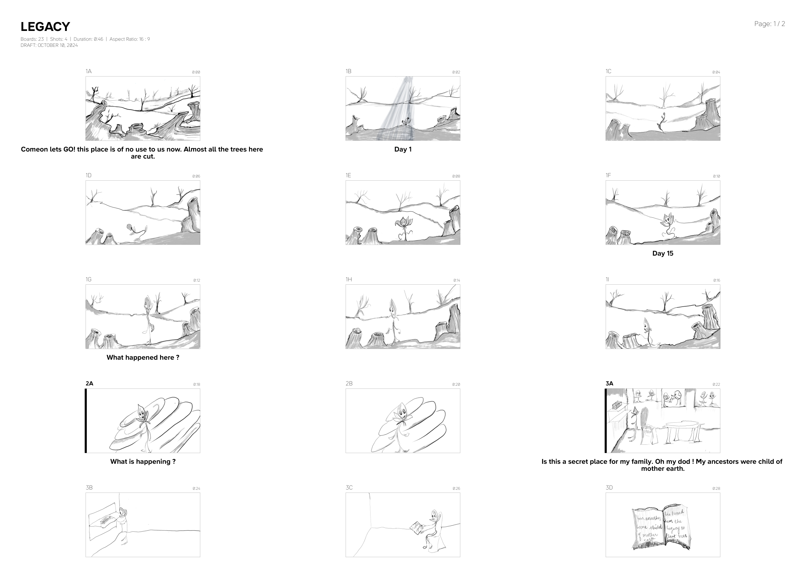
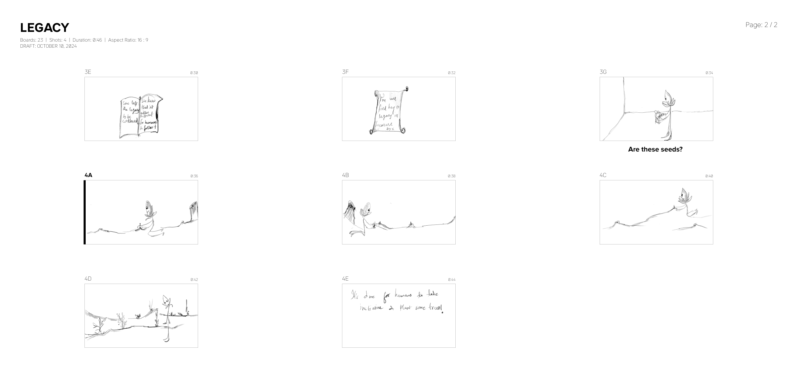
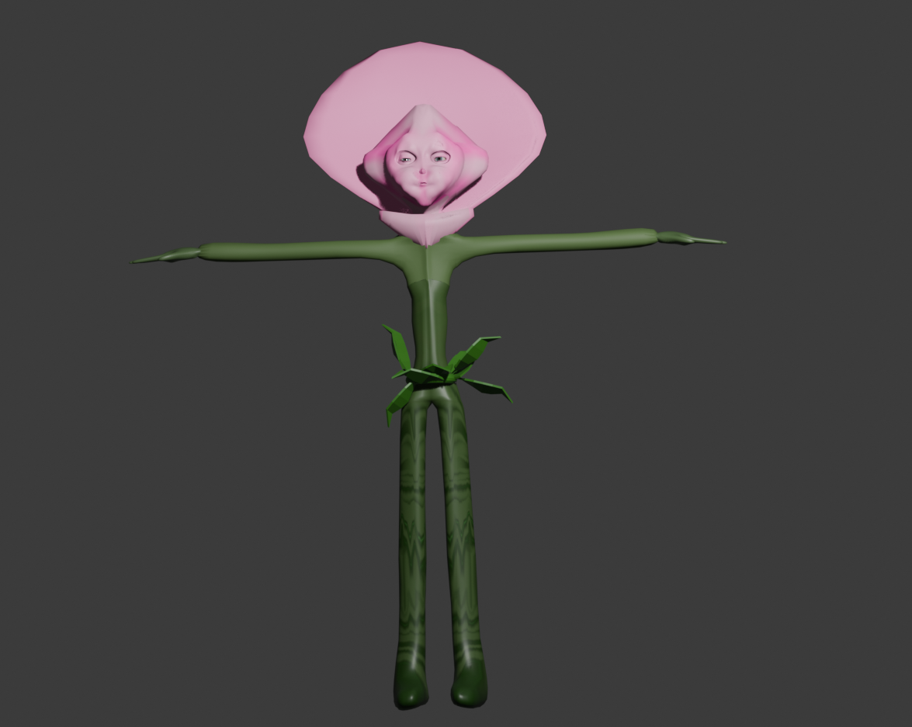
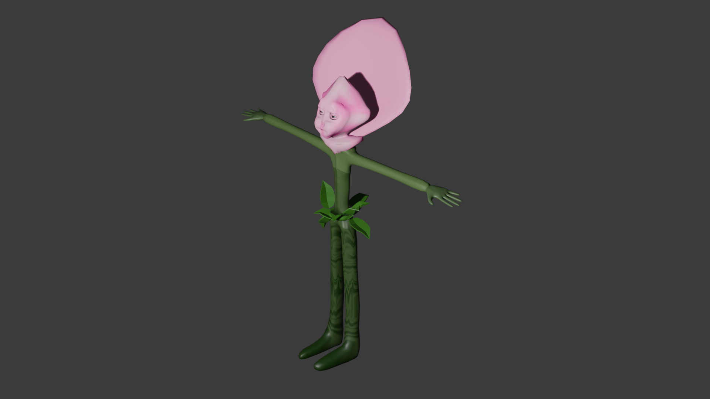

# Summary

This project focuses on developing *Legacy*, a 3D animated movie created using motion capture and rendered entirely in real time through Three.js. The goal was to produce a film that could run directly in a web browser without long rendering times or heavy post-processing. The project also explores the transfer of human-recorded motion capture to a non-human, plant-like character—an approach that highlights the creative possibilities of mocap beyond traditional humanoid rigs.

In a time when demand for 3D animated films is rapidly increasing and tools like Maya and Blender dominate production pipelines, Three.js is emerging as an efficient alternative for real-time rendering. A number of visually impressive films, such as *The Aviator*, *Lights*, and *The Journey*, demonstrate its potential. Inspired by this shift, I chose Three.js to develop this film. The title *Legacy* reflects the learning legacy gained throughout the project.

Creating expressive animation for unique, non-human characters can be challenging with traditional frame-by-frame workflows. This project shows how motion capture can produce fluid, emotional performances even for unconventional rigs. Beyond technical contributions, the film aims to mesmerize and emotionally motivate viewers, while demonstrating that accessible, browser-based pipelines can produce a complete 3D animated movie within a short time frame.

# Statement of need

The main objective of this project was to develop a motion-capture-driven 3D animated movie that runs directly in a web browser. Creating the entire film in Blender and then exporting for the web would have required significant rendering time, large file handling, and multiple conversion steps. Offline rendering tools like Blender and Maya are powerful, but they become slow and unstable when scenes grow large or when many animation files are involved.

Three.js offers an efficient alternative through real-time rendering and fast iteration. It requires no paid plugins, works across platforms, and is ideal for individuals who are comfortable with coding but overwhelmed by traditional 3D software complexity. Combining Blender for 3D modeling and rigging with Three.js for real-time playback created a simple and effective workflow.

This project demonstrates how a complete 3D animated movie can be produced in under two months using a lightweight, real-time web-based pipeline. It also serves as an example for students and creators who want to explore Three.js for animation, especially those interested in transferring human mocap onto unique, non-human characters. Additionally, the movie carries an environmental message, encouraging viewers to plant more trees and recognize the urgency of environmental protection.

# Process

## Storyboarding

The storyboarding was done using *Storyboarder*, where the full visual layout of the film was planned.

**Figure 1. Storyboard Part 1**  

**Figure 2. Storyboard Part 2**  

## Modeling

The 3D character and other assets were created using Blender, while additional environmental elements were sourced from online libraries.

**Figure 3. Main Character – Front View**  

**Figure 4. Main Character – Side View**  

## Texturing

Textures, PBR maps, and HDRIs were downloaded from Poly Haven, providing high-quality, CC0-licensed assets suitable for real-time rendering.

## Rigging

The character’s body was rigged using Mixamo’s free rigging tool. Facial blendshapes compatible with ARKit were created using the FaceIt add-on, enabling facial motion capture using the Rokoko Face app.

## Motion Capture

Motion capture was recorded using Rokoko’s face and body capture tools:

- Body motion: captured via Rokoko SmartSuit and exported in BVH format  
- Facial motion: captured via Rokoko Face Capture and exported as ARKit-compatible blendshapes  

## Retargeting and Refinement

The Rokoko add-on for Blender was used to retarget and refine the body and face mocap data onto the non-human character. Multiple mocap recordings were combined and refined to create expressive and natural animation.

## Importing into Three.js

All assets were exported from Blender as GLB files. Inside Three.js:

- Scenes were created according to storyboard references  
- Lighting was handled using Three.js directional, ambient, and point lights  
- Camera movements were programmed and sequenced  
- Animations were synchronised and played using the Three.js animation mixer  
- Real-time rendering was performed with `WebGLRenderer`  

All shot sequencing, timing, and transitions were created in Three.js, enabling the entire film to run directly inside a web browser without offline rendering.

# Acknowledgements

Special thanks to Professor Tejaswi Gowda for support, guidance, and continuous feedback throughout the development of this project.

# References
